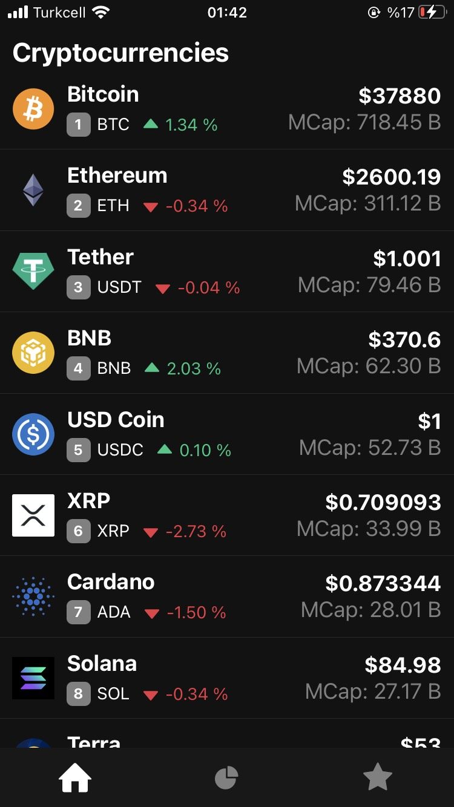
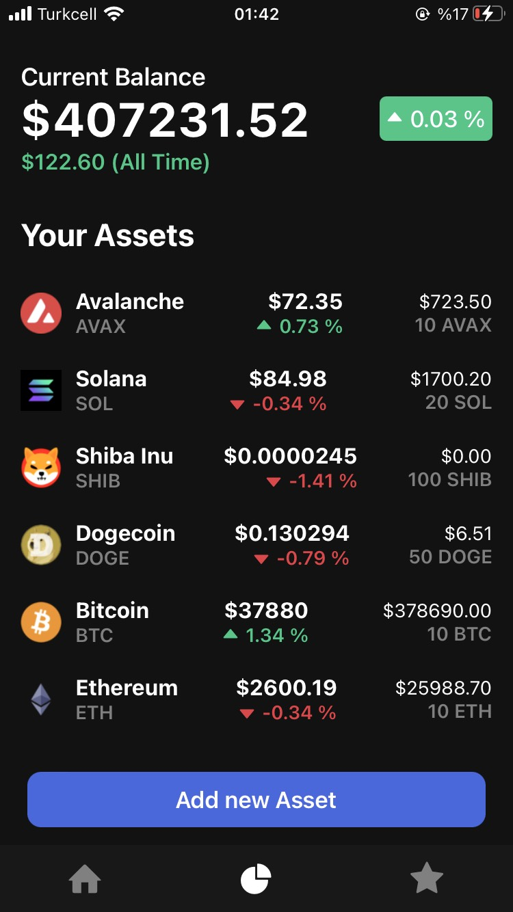
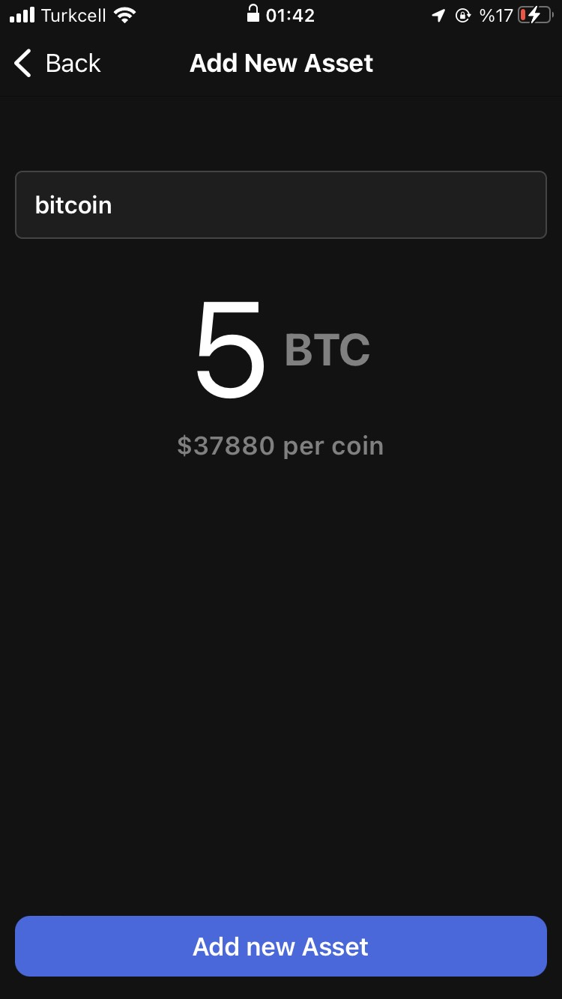
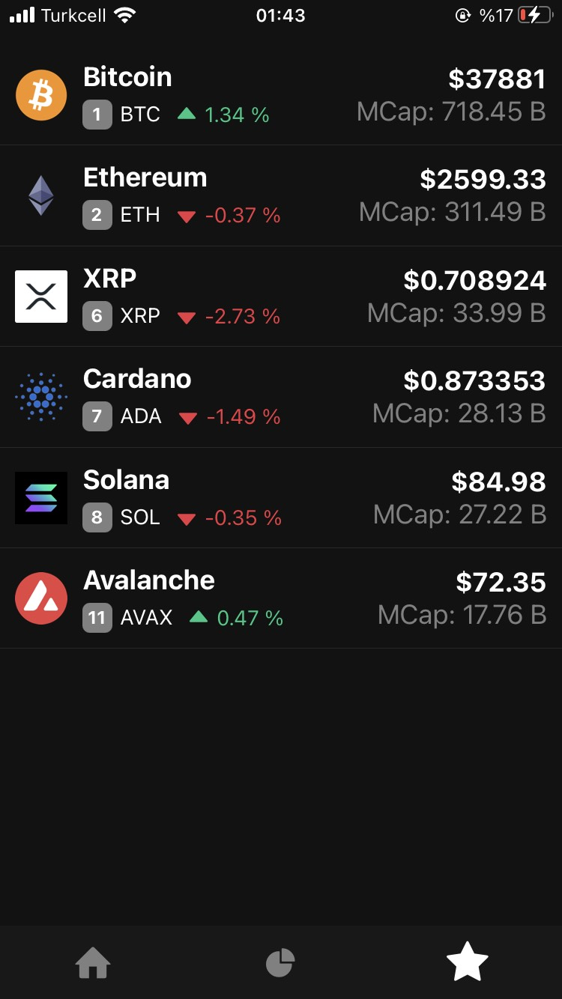
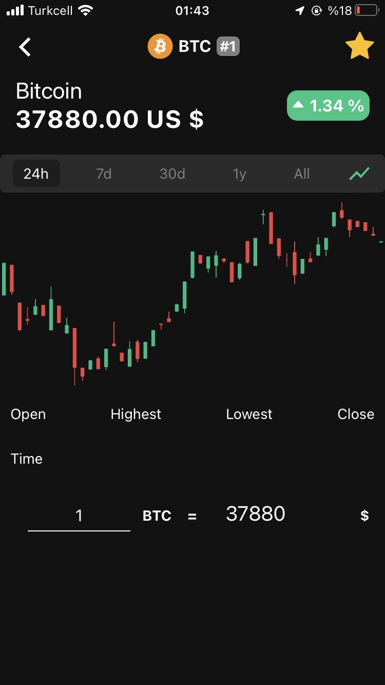
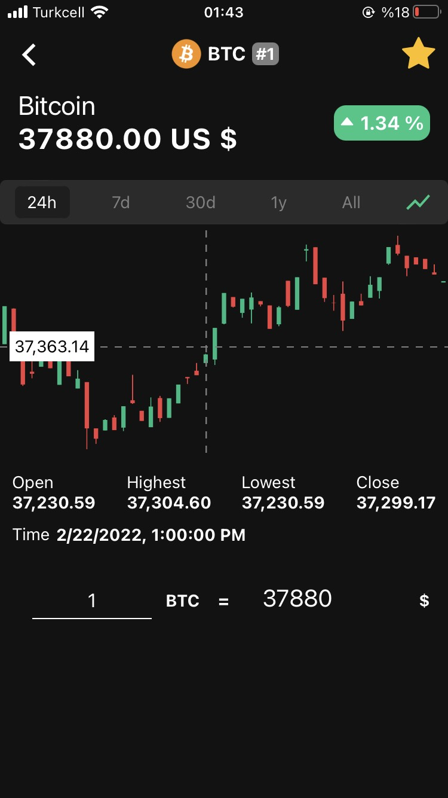
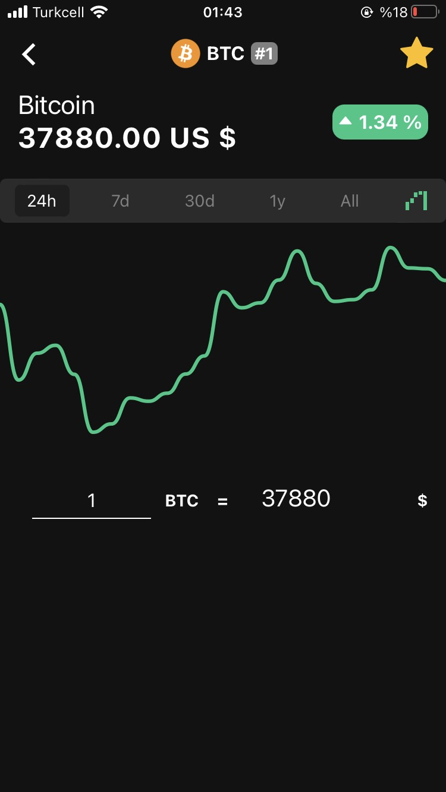
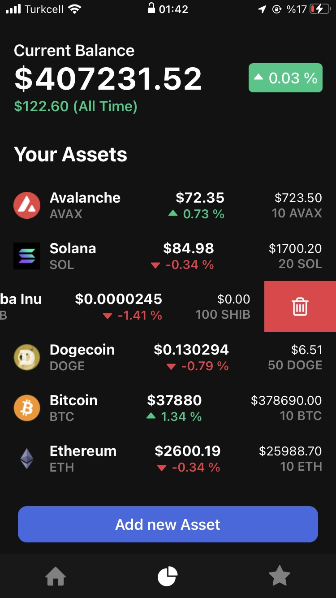

### Crypto tracker app with React Native

Users can add cryptocurrencies into their portfolio and watchlist

### Used:

- **AsyncStorage** to store the data for watchlist and portfolio
- **ContextAPI** and **Recoil** to manage global states for watchlist, portfolio and listing all the coins
- **Axios** to do API calls
- **API**: https://www.coingecko.com/tr/api/documentation
- **Chart** **libs** to show information about cryptocurrencies
- **Swipelistview** **lib** for users to delete currencies in their portfolio
- **Searchable** **dropdown** **lib** for adding new assets to the portfolio

### Screenshots:

<table>
  <tr>
    <td>Home Screen</td>
     <td>Portfolio Screen</td>
     <td>Add new asset screen</td>
  </tr>
  
  <tr>
    <td></td>
    <td></td>
    <td></td>
  </tr>
 </table>

<table>
  <tr>
    <td>Watchlist Screen</td>
     <td>Detail Screen Candle Chart</td>
     <td>Detail Screen Candle Chart with Info</td>
  </tr>
  
  <tr>
    <td></td>
    <td></td>
    <td></td>
  </tr>
 </table>
 
 <table>
  <tr>
    <td>Detail Screen Line Chart</td>
     <td>Portfolio Screen Delete</td>
  </tr>
  
  <tr>
    <td></td>
    <td></td>
  </tr>
 </table>
